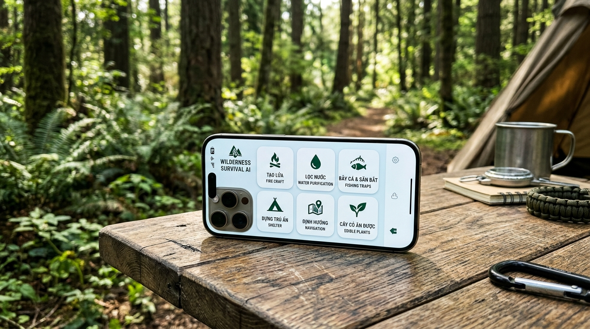
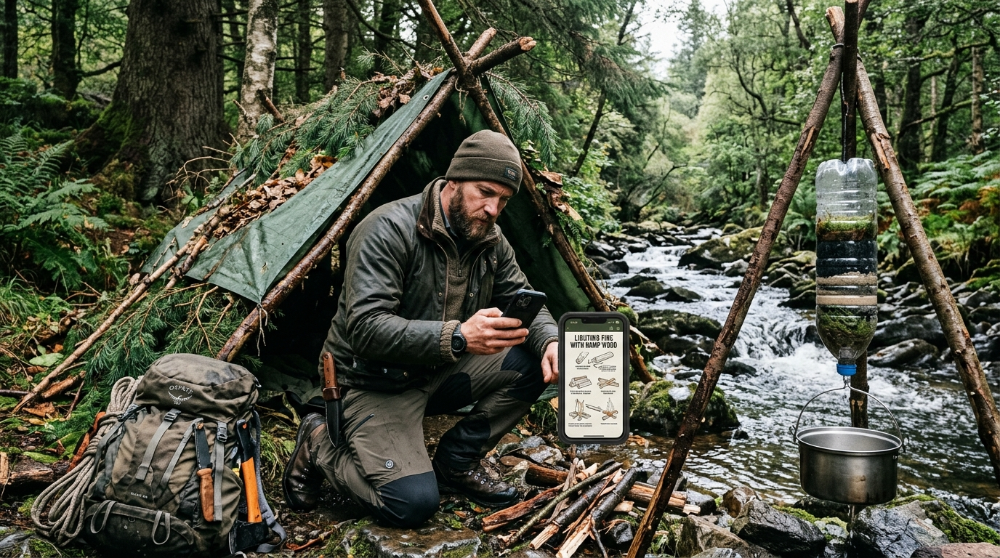
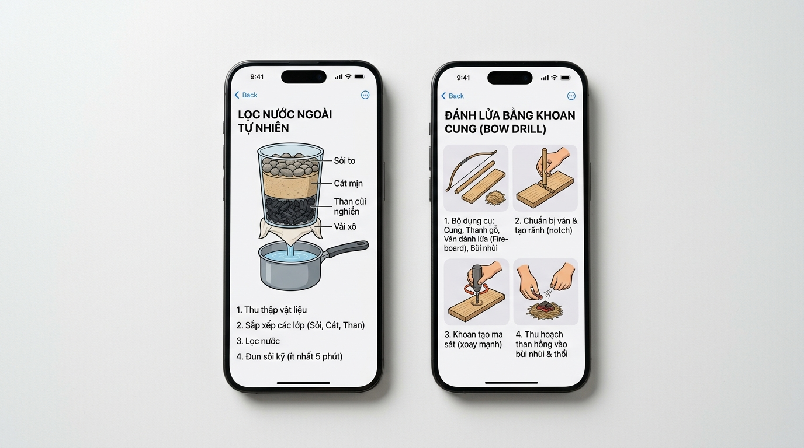
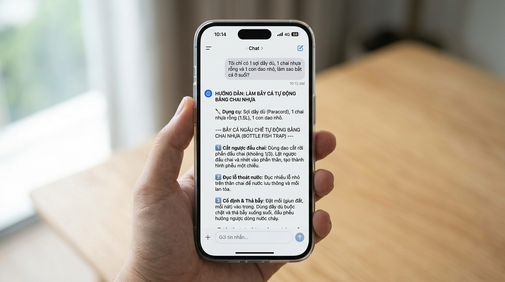

# TÀI LIỆU ĐẶC TẢ NGHIỆP VỤ & TỔNG QUAN GIẢI PHÁP
# HỆ THỐNG TRỢ LÝ AI SINH TỒN HOANG DÃ NGOẠI TUYẾN (WILDERNESS SURVIVAL & BUSHCRAFT AI)

**Dự án:** Ứng dụng Sinh Tồn Thực Chiến & Cẩm Nang Rừng Rậm Ngoại Tuyến (Offline Wilderness Survival OS)  
**Phiên bản:** v3.0 (Comprehensive Bushcraft Edition)  
**Tác giả:** Business Analyst & Outdoor Survival Specialist Team  
**Thiết bị mục tiêu:** iPhone 15 Pro trở lên (Apple Silicon A17 Pro / M-series, iOS 17+)  
**Tài liệu kỹ thuật gốc:** [Survival_Offline_AI_RAG_Technical_Spec_v0.2.docx](file:///Users/e4gle/Documents/LLM_local/Survival_Offline_AI_RAG_Technical_Spec_v0.2.docx)  
**Slide trình chiếu HTML:** [survival_ai_slides.html](file:///Users/e4gle/Documents/LLM_local/survival_ai_slides.html)

---

## 1. TỔNG QUAN SẢN PHẨM & ĐỊNH VỊ THỊ TRƯỜNG



### 1.1 Bài toán thực tế của người đi rừng & sinh tồn ngoài thiên nhiên
Khi một người bước chân vào rừng rậm, vượt suối, leo núi, thám hiểm hang động hoặc đối mặt với thiên tai chia cắt (bão lũ, sạt lở, mất điện, mất sóng di động hoàn toàn):
* **Mất kết nối viễn thông:** Điện thoại hoàn toàn không có sóng 4G/Wi-Fi hay GPS ổn định.
* **Tình huống sinh tử đa dạng:** Không chỉ là tai nạn y tế khẩn cấp, mà là **hàng loạt bài toán sinh tồn cơ bản mỗi ngày**:
  * *Làm sao có nước uống mà không bị nhiễm trùng đường ruột?*
  * *Làm sao đánh được lửa để sưởi ấm và xua đuổi thú dữ khi diêm quẹt bị ướt sũng?*
  * *Làm sao dựng được một cái lán trú ẩn chống mưa dầm và giữ nhiệt cơ thể trong đêm buốt giá?*
  * *Làm sao kiếm ăn, bắt cá ở suối hay đặt bẫy thú nhỏ khi cạn kiệt lương thực mang theo?*
  * *Làm sao phân biệt được cây cỏ dại ăn được với cây kịch độc?*
  * *Làm sao tự nẹp xương gãy hoặc băng bó vết thương rách sâu bằng vật liệu rừng núi?*

### 1.2 Tuyên ngôn định vị sản phẩm (Product Mission)
> **"Biến chiếc iPhone trong tay bạn thành người thầy sinh tồn dày dặn kinh nghiệm nhất: Hoạt động 100% ngoại tuyến, mang theo trọn bộ 500+ kỹ năng Bushcraft quân đội và trí tuệ nhân tạo cục bộ có khả năng ứng biến, chỉ dẫn chế tạo công cụ sinh tồn từ bất kỳ vật dụng nào bạn đang có trong ba-lô."**

---

## 2. BỨC TRANH THỰC ĐỊA: MỘT CUỘC SINH TỒN THỰC THỤ



Hình ảnh trên mô tả tình huống điển hình của người dùng:
1. **Lán trú ẩn chữ A (A-frame shelter):** Dựng bằng cành cây rừng, đan lá dương xỉ và bạt lót chống mưa gió.
2. **Bộ lọc nước tự chế (DIY Water Filter):** Treo trên giá 3 chân, dùng vỏ chai nhựa rỗng chứa các lớp: Sỏi to ➔ Cát mịn bờ suối ➔ Than củi đập dập từ bếp lửa để khử độc ➔ Vải xô áo thun hứng nước trong vào ca kim loại đun sôi.
3. **Chiếc điện thoại mở sẵn hướng dẫn:** Tra cứu cách nhóm lửa từ lõi gỗ thông già (Fatwood) khi củi xung quanh đều ẩm ướt sau cơn mưa rừng.

---

## 3. HỆ THỐNG 6 TRỤ CỘT KỸ NĂNG SINH TỒN (CORE KNOWLEDGE PILLARS)

Kho tri thức đóng gói sẵn trong ứng dụng bao gồm hơn 500 quy trình kỹ thuật được chuẩn hóa từ cẩm nang đặc nhiệm quân đội (SAS Survival Handbook, US Army Survival Manual FM 21-76) và kinh nghiệm bản địa Đông Nam Á:

| Trụ cột kỹ năng | Các bài toán cụ thể | Phương pháp & Kỹ thuật chi tiết |
| :--- | :--- | :--- |
| **1. TẠO LỬA & GIỮ NHIỆT (Firecraft)** | • Đánh lửa khi không có bật lửa/diêm<br/>• Nhóm lửa trong rừng mưa ẩm<br/>• Bếp giữ than qua đêm | • Khoan cung (Bow drill), cọ xát gỗ (Hand drill), đánh đá lửa (Flint).<br/>• Tìm nhựa thông khô (Fatwood), cạo phoi mỏng (Feather sticks).<br/>• Bếp hầm Dakota (đào 2 hố thông nhau hút gió, giấu khói).<br/>• Đánh lửa ngẫu chế bằng pin điện thoại hoặc đáy chai thủy tinh. |
| **2. TÌM & LỌC NƯỚC (Water Purification)** | • Tìm nước sạch trên núi đá<br/>• Lọc nước suối đục ngầu<br/>• Khử trùng vi khuẩn e.Coli | • Chế bình lọc 4 tầng: Sỏi ➔ Cát mịn ➔ Than củi đập dập ➔ Vải xô.<br/>• Bọc túi nylon quanh tán lá cây hứng hơi nước (Transpiration bag).<br/>• Đào hố lọc cát cạnh bờ suối để nước tự ngấm trong.<br/>• Đun sôi lăn tăn tối thiểu 3–5 phút. |
| **3. BẪY CÁ & KIẾM ĂN (Foraging & Trapping)** | • Đói lả giữa suối sâu<br/>• Nhận diện cây ăn được<br/>• Phòng chống ngộ độc | • Bẫy cá ngẫu chế bằng chai nhựa 1.5L cắt ngược đầu tạo phễu một chiều.<br/>• Đắp bờ đá lùa cá (Stone weir) và xiên cá bằng cành tre chẻ 4 mũi.<br/>• Bẫy thòng lọng nhánh cây bật (Figure 4 Deadfall & Snare).<br/>• Quy tắc 5 bước thử nghiệm độc tố (Universal Edibility Test). |
| **4. DỰNG LÁN TRÚ ẨN (Shelter Crafting)** | • Chống mưa gió bão lũ<br/>• Giữ nhiệt chống rét buốt<br/>• Tránh rắn rết, côn trùng | • Lán chữ A (A-Frame), Lán dựa vách đá hứng nhiệt lửa (Lean-to).<br/>• Lán lá khô cách nhiệt (Debris Hut) dày 40cm chống rét 5°C.<br/>• Thắt các nút dây sinh tồn: Nút ghế đơn (Bowline), nút siết Trucker’s hitch. |
| **5. ĐỊNH HƯỚNG TỰ NHIÊN (Navigation)** | • Mất la bàn và mất sóng GPS<br/>• Sương mù dày đặc mất dấu | • Xác định Đông - Tây bằng bóng cọc gậy mặt trời (Shadow stick).<br/>• Xác định hướng Bắc ban đêm bằng sao Bắc Cực (sao Bắc Đẩu).<br/>• Hướng rêu mọc ẩm ướt trên thân cây, hướng nghiêng của ngọn cây đón gió.<br/>• Quy tắc vàng: Luôn đi xuôi theo dòng chảy sông suối để về hạ lưu có làng. |
| **6. SƠ CỨU HOANG DÃ (Wilderness First Aid)** | • Gãy xương trên vách đá<br/>• Rách thịt chảy máu sâu<br/>• Rắn độc cắn, ong rừng đốt | • Nẹp xương cẳng tay/chân bằng 2 cành cây thẳng và dây dù/dải áo.<br/>• Garo và băng ép vết thương rách sâu bằng vải sạch.<br/>• Sơ cứu rắn cắn: Bất động chi, quấn băng đàn hồi, tuyệt đối KHÔNG rạch hút nọc.<br/>• Chống hạ thân nhiệt (Hypothermia) và chống sốc nhiệt (Heat stroke). |

---

## 4. THIẾT KẾ MINH HỌA TRỰC QUAN & TÍNH NĂNG AI ỨNG BIẾN

### 4.1 Minh họa kỹ thuật chuẩn xác (Illustrated Guides)


Khác với văn bản thuần túy, ứng dụng hiển thị các sơ đồ lát cắt rõ ràng:
* **Sơ đồ lọc nước 4 tầng:** Minh họa độ dày của từng lớp (Sỏi to cản rác bẩn ➔ Cát mịn giữ bùn vi sinh ➔ Than củi hấp phụ kim loại nặng & mùi hôi ➔ Vải xô áo thun hứng nước trong).
* **Sơ đồ đánh lửa khoan cung (Bow drill):** Vẽ rõ góc vát 45 độ chữ V trên ván gỗ để mùn than tích tụ, cách ghì gối giữ trụ thẳng đứng và cách bọc than hồng vào bùi nhùi để thổi bùng ngọn lửa.

### 4.2 Trí tuệ nhân tạo ứng biến theo đồ có sẵn trong ba-lô (AI Improvisation Engine)


Đây là tính năng độc quyền tạo nên sự khác biệt hoàn toàn với một cuốn sách điện tử PDF:
* **Tình huống:** Người dùng mắc kẹt bên suối và gõ câu hỏi:  
  * *"Tôi chỉ có 1 sợi dây dù, 1 chai nhựa rỗng và 1 con dao nhỏ, làm sao bắt cá ở suối?"*
* **Cơ chế suy luận cục bộ (Local LLM Qwen 4B):**
  1. AI trích xuất kho cẩm nang bẫy cá nước ngọt.
  2. Khớp các vật dụng người dùng có với sơ đồ chế tạo bẫy.
  3. Xuất hướng dẫn 3 bước:
     * *Bước 1: Cắt rời 1/3 đầu chai nhựa, lật ngược nhét vào thân làm phễu 1 chiều.*
     * *Bước 2: Dùng mũi dao đục các lỗ nhỏ quanh thân chai để nước lưu thông và mùi mồi lan tỏa.*
     * *Bước 3: Đào giun đất bỏ vào chai, dùng dây dù buộc cổ chai thả ngược dòng nước chảy.*

---

## 5. BẢNG CAM KẾT CHẤT LƯỢNG KỸ THUẬT & PHẦN CỨNG (SLA)

| Hạng mục | Cam kết hiệu năng (SLA) | Ý nghĩa nghiệp vụ trong môi trường hoang dã |
| :--- | :--- | :--- |
| **Dung lượng lưu trữ** | $\le$ 3.5 GB trọn gói | Cài đặt 1 lần trước khi đi rừng, không bao giờ cần kết nối mạng để tải thêm. |
| **Thời gian tra cứu cẩm nang** | &lt; 40 miligiây (p50) | Quét qua 500 kỹ năng và hàng chục ngàn đoạn trích trong nháy mắt. |
| **Thời gian phản hồi của AI** | 1.2 – 1.8 giây (TTFT) | AI bắt đầu xuất chữ ngay lập tức, không gây ức chế tâm lý chờ đợi. |
| **Tiết kiệm pin & Bảo vệ máy** | Chuyển chế độ 2B khi pin &lt; 20% | Giảm 40% lượng pin tiêu hao, giúp điện thoại sống sót lâu nhất có thể. |
| **Tính xác thực của cẩm nang** | 100% có cơ sở thực nghiệm | Không bịa đặt các mẹo sinh tồn độc hại hoặc phản khoa học. |

---

## 6. LỘ TRÌNH 12 TUẦN TRIỂN KHAI DỰ ÁN

```
Tuần 01 - 03: GIAI ĐOẠN 1 — BIÊN TẬP VÀ VẼ SƠ ĐỒ 500 KỸ NĂNG BUSHCRAFT
  ├── Chuẩn hóa cẩm nang: Lửa, Nước, Bẫy cá, Trú ẩn, Định hướng, Cây cỏ ăn được.
  ├── Thiết kế đồ họa vector lát cắt: Bình lọc nước, Khoan cung, Bẫy thú, Nút dây.
  └── Xây dựng bộ quy tắc kiểm tra độc tố cây cỏ (Universal Edibility Test).

Tuần 04 - 06: GIAI ĐOẠN 2 — TỐI ƯU ĐỘNG CƠ TÌM KIẾM OFFLINE TỐC ĐỘ CAO
  ├── Đóng gói SQLite FTS5 với bộ từ điển tiếng Việt dã ngoại (từ lóng, tên loài).
  ├── Chuyển đổi mô hình nhúng multilingual-e5 sang Apple Core ML INT8.
  └── Tích hợp thuật toán hợp nhất RRF giữa từ khóa kỹ thuật và ngữ nghĩa tự nhiên.

Tuần 07 - 09: GIAI ĐOẠN 3 — TÍCH HỢP AI CỤC BỘ ỨNG BIẾN TRÊN APPLE SILICON
  ├── Tối ưu hóa Qwen3.5-4B và 2B nén 4-bit chạy trên chip A17 Pro.
  ├── Huấn luyện Cổng Kiểm Duyệt An Toàn (Grounding Gate) chống ảo giác sinh tồn.
  └── Thiết lập cơ chế tự động hạ tải sang 2B khi ngoài trời nắng nóng hoặc pin yếu.

Tuần 10 - 12: GIAI ĐOẠN 4 — THỬ NGHIỆM THỰC ĐỊA & RA MẮT TOÀN CẦU
  ├── Thử nghiệm thực địa tại Vườn Quốc Gia Cát Tiên & Rừng Hoàng Liên Sơn.
  ├── Nghiệm thu cùng các chuyên gia Bushcraft và lực lượng Kiểm lâm.
  └── Đóng gói phát hành chính thức trên Apple App Store.
```

---
*Tài liệu đã được đồng bộ hoàn toàn với bộ Slide thuyết trình pitching tại [survival_ai_slides.html](file:///Users/e4gle/Documents/LLM_local/survival_ai_slides.html).*
